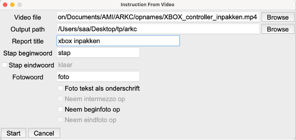

# Activiteiten capturing tool.

*Dit protoypte tool is gemaakt in het kader van het RAAK MKB project AR in de maakindustrie door het Saxion lectoraat Ambient Intelligence*

## Doel: Automatische omzetting video
Het idee van dit prototype is om de handelingen die een expert uitvoert tijdens een bepaalde taak op te nemen als video. Hierbij is het gewenst om gebruik te maken van een camera die op het hoofd wordt gedragen, zoals de Vuzix m400. (Een alternatief zou bijvoorbeel een GoPro camera kunnen zijn.) De expert heeft dan zijn handen vrij om alle handelingen uit te voeren en de camera volgt de blik van de expert tijdens de uitvoering van de taak. De expert vertelt steeds wat hij / zij aan het doen is. Naderhand wordt de gesproken tekst (automatisch) getranscribeerd en omgezet naar een stappenplan. Dit stappenplan kan dan, waar gewenst, verder worden uitgewerkt naar een serie instructies voor de werkvloer.

Een groot voordeel van een systeem als de Vuzix m400 (of het vergelijkbare RealWear systeem) is dat de omgevingsgeluiden goed worden uitgefilterd. Ook in een lawaaiige omgeving is de spraak nog steeds goed hoorbaar op de opgenomen video.

Verder kan het volgende worden meegenomen:
* De expert kan aangeven dat er een nieuwe stap begint, bijvoorbeeld door het woord “stap” uit te spreken
* De expert kan, indien gewenst, ook aangeven als een stap is afgerond (sleutelwoord “klaar”). Als er geen eindwoord wordt gebruikt geeft een volgend gebruik van het woord stap zowel het einde van de vorige stap aan als het begin van een nieuwe stap.
* Op belangrijke momenten kan de expert aangeven dat er een foto moet worden opgenomen in het stappenplan (sleutelwoord “foto”).

De transcriptie en de uitwerking naar een stappenplan is gedaan met behulp van python en de library whisper_timestamped. Deze bibliotheek geeft de mogelijkheid om automatische spraakherkenning in meerdere talen uit te voeren waarbij van de afzonderlijke woorden de tijd wordt vastgelegd waarop ze werden uitgesproken in de video.

Voor gebruikersvriendelijkheid is hier een eenvoudige user interface bijgebouwd. Zie hieronder.

 

Deze interface maakt het mogelijk om met verschillende instellingen te werken. Zo kunnen de sleutelwoorden worden gewijzigd (als iemand bijvoorbeeld liever “begin” gebruikt om het begin van een stap weer te geven), kan ervoor worden gekozen om een onderschrift bij de foto’s te plaatsen en om een foto in de instructie te zetten van het begin en / of van het einde van elke stap. Ten slotte kan, als er gebruik wordt gemaakt van een expliciet eind woord van een stap, ervoor gekozen worden om de gesproken tekst na het “eind” woord en voor het volgende “begin” woord al dan niet op te nemen in het stappenplan (“intermezzo” in de interface).

## Installatie / Gebruik

### Windows

* Download en installeer python versie 3.10.19 (of later)
	Ga naar: https://www.python.org/downloads/release/python-31019/
	Download de Windows installer (64-bit)
	Voer het gedownloade bestand uit om python te installeren. Selecteer de bovenste optie (standaard installatie)
* Maak een map aan op je systeem en kopieer de volgende bestanden naar die map:
	* process_video.py
	* video2instruction_UI.py
	* requirements.txt
* Open de map in de verkenner. Klik met de rechtermuisknop ergens in de map (in de 'lege ruimte', dus niet op een van de bestanden) en selecteer: "Open Terminal"
* voer het volgende commando in (en sluit dit af met enter):
	py -m pip install -r requirements.txt

  Python zal nu aanvullende benodigde bibliotheken installeren. Dit kan enige tijd in beslag nemen. Mogelijk verschijnen er diverse waarschuwingen; dat is geen probleem.

* Als de installatie klaar is (dat kan je oa zien doordat de opdrachtprompt '>' weer in beeld verschijnt in de terminal) kan de terminal worden gesloten.

#### Opstart programma

* Dubbelklik het bestand 'video2instruction.py' om het programma te starten.
* Bij de eerste keer gebruik zal er eerst een AI model worden gedownload dat gebruikt wordt voor de tekstanalyse. Dat kan enige tijd in beslag nemen.
* De eerste keer dat een filmpje wordt geanalyseerd zal er een transcriptiebestand worden gemaakt en opgeslagen in de aangegeven doelmap (ouput path). Dat kan de nodige tijd in beslag nemen (in een ander terminal venster zal een progress bar zichtbaar worden). Mocht je een paar kleine wijzigingen aan willen brengen in het rapport (bijvoorbeeld ander stopwoord of een andere titel), dan zal de tweede keer veel sneller zijn. Er wordt dan gebruik gemaakt van de bestaande transcriptie.
* Naast de transcriptie worden er een .md en een .html pagina aangemaakt waarin het rapport staat. Dit kan als basis dienen voor het uit te voeren stappenplan. In de meeste gevallen zal dit nog moeten worden aangescherpt. Het wijzigen van het stappenplan kan door rechtstreeks de html te wijzigen, of door de pagina te openen in Word bijvoorbeeld.

### OSX / Linux
Ontwikkeld en getest met python 3.10. 

Om te gebruiken, installeer eerst alle dependencies:

	pip install -r requirements.txt

Start het programma met een eenvoudige user interface middels het commando

	python video2instruction_UI.py

UI settings worden opgesalge in de root folder van de gebruiker in het bestandje `video2instruction_settings.cfg`

Om uit te voeren zonder user interface moet de functie `main()` in `process_video.py` worden aangepast; voer dan het volgende uit.

	python process_video.py

Zie verder opmerkingen in "Opstart programma" in de vorige paragraaf (Windows)
